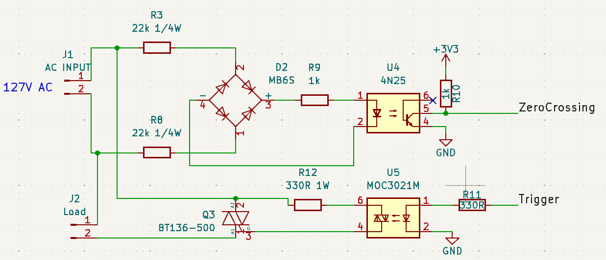

# ESP32ULPDimmer

> Allows ESP32 boards to control one AC dimmer using ULP on second plane.
This library does not use interrupts and resources of the main processors.


## Usage

1. Include the library in your Sketch:

```cpp
#include <ESP32ULPDimmer.h>
```

2. Call `int ULPDimmerBegin(const int zc_pin, const int trigger_pin, const  unsigned int cycle_freq); // cycle_freq  is 50 or 60Hz` in your setup() function (The zc_pin and trigger_pin must be [ESP32 rtc gpio pins](https://docs.espressif.com/projects/esp-idf/en/stable/esp32/api-reference/peripherals/gpio.html)):

```cpp
void setup() {
  Serial.begin(115200);
  while (!Serial);
  Serial.println("start");

  while (ULPDimmerBegin(25, 26, 60)) {
    Serial.println("Invalid rtc_io pins!");
    delay(100);
  }
  
}
```

3. Use `void ULPDimmerSetDuty(unsigned int duty); // 0 to 100%`  to set duty cycle. E.g.:

```cpp
int duty = 0;

void loop() {
  ULPDimmerSetDuty(duty);

  Serial.print("Duty= ");
  Serial.println(ULPDimmerGetDuty());

  duty++;

  if (duty > 100) duty = 0;

  delay(500);
}
```

## Circuit

 


## License

Released under the [MIT License](LICENSE). Copyright (C) 2024  Luis Claudio Gambôa Lopes <lcgamboa@yahoo.com>
